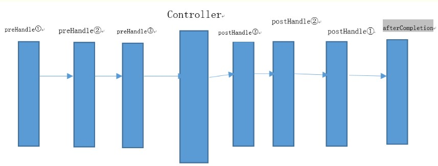

# 环境搭建
1. 创建maven工程自己导jar包
2. idea中使用Spring Initializer快速创建项目

# 开发
## 常用注解
### @SpringBootApplication
标注一个主程序类，说明这是一个springboot应用

### @ResponseBody
- 加在类上，则该类所有方法都是将返回数据直接写给浏览器
- 加在方法上，用于将Controller的方法返回的对象，通过适当的`HttpMessageConverter`转换为指定格式后，写入到Response对象的body数据区
- 一般返回的数据不是html页面，而是json,xml时使用
- 通常使用`@RequestMapping`后，返回值解析为跳转路径，加上`@ResponseBody`后返回结果不会解析为跳转路径，而是直接写入http响应正文

### @RestController
@Controller + @ResponseBody


### @RequestBody
1. 常用来处理`content-type`不是默认的`application/x-www-form-urlcoded`，如:`application/json`或者是`application/xml`等。常用其来处理`application/json`类型
2. 通过`@requestBody`可以将请求体中的 ==JSON字符串== 绑定到相应的bean上，当然，也可以将其分别绑定到对应的字符串上
```javascript
$.ajax({
　  url:"/login",
　  type:"POST",
　　data:'{"userName":"admin","pwd","admin123"}',
　　content-type:"application/json charset=utf-8",
　　success:function(data){
　　　　　alert("request success ! ");
　　}
});
```
```java
@requestMapping("/login")
　　　　public void login(@requestBody String userName,@requestBody String pwd){
　　　　　　System.out.println(userName+" ："+pwd);
　　　　}
```
若有一个实体类有如下字段：
```java
String userName;
String pwd;
```
则上述参数可改写为:`@requestBody User user`,<font color="red">JSON字符串中的key必须对应user中的属性名</font>

## 配置文件
### 将配置文件中配置的属性值映射到某个类中
#### @ConfigurationProperties(prefix="")
- 用在类上，该注解告诉springboot将本类中所有属性和配置文件中相关配置进行绑定
- 其中prefix属性的值表示对置文件中哪个属性下的值进行映射
- 只有该组件是容器的组件，才能使用`@ConfigurationProperties(prefix="")`的功能，所以同时在类上需加上`@Component`注解

#### @Value(val)
用在单个属性上,val取值有如下几种：
- 字面量
- ${key}：从环境变量，配置文件
- #{SpEL}
```java
某实体类如下：
@Component
public class Person{
    @Value("${person.name}")
    private String name;
    @Value("#{11*2}")
    private Integer age;
}
配置文件中：
person.name="zhangsan"
```

#### @ConfigurationProperties对比@Value
||@ConfigurationProperties | @Value
---|--- | ---
功能 | 批量注入配置文件中的属性 | 一个个指定
松散绑定（松散语法,不区分-和驼峰差别）|	支持|	不支持
SpEL	|不支持	|支持
JSR303数据校验|	支持|	不支持
复杂类型封装|	支持|	不支持

#### @PropertySource
- 用在需从配置文件中赋值的类上，加载指定的配置文件,直接使用`@ConfigurationProperties`注解默认是从全局配置文件中取值
- 如`@PropertySource(value = {"classpath:person.properties"})`表示从person.properties中取值

#### @ImportResource
- 用在主程序类上，导入spring的配置文件使其生效
- Spring Boot里面没有Spring的配置文件，自己编写的配置文件，也不能自动识别
- 如`@ImportResource(locations = {"classpath:beans.xml"})`表示加载beans.xml配置文件使其生效
- <font color="red">但springboot推荐采用全注解的方式给容器添加组件，demo如下：</font>
```java
/**
 * @Configuration：指明当前类是一个配置类；就是来替代之前的Spring配置文件
 * 在配置文件中用<bean><bean/>标签添加组件
 */
@Configuration
public class MyAppConfig {

    //将方法的返回值添加到容器中；容器中这个组件默认的id就是方法名,也可以自己指定@Bean(name="")
    @Bean
    public HelloService helloService(){
        System.out.println("配置类@Bean给容器中添加组件了...");
        return new HelloService();
    }
}
```

### 配置文件加载位置
以下位置优先级从高到低
- file:./config
- file:./
- classpath:/config
- classpath:/


### 添加springmvc的配置
- 创建一个配置类，需要继承`WebMvcConfigurerAdapter`，使用WebMvcConfigurerAdapter <font color="red">扩展</font> SpringMVC的功能,要添加什么功能，重写对应的方法
```java
@Configuration
public class MyMvcConfig extends WebMvcConfigurerAdapter {
    //将url为/hello的请求跳转success页面
    @Override
    public void addViewControllers(ViewControllerRegistry registry) {
        registry.addViewController("/hello").setViewName("success");
    }
}
```
- 将所有springboot关于springmvc的配置都无效，只使用自己的配置，在配置类上加上`@EnableWebMvc`注解

#### 登录拦截器

1. 将登录信息保存到`session`中
2. 创建一个类实现`HandlerInterceptor`接口
```java
/**
 * 登陆检查，
 */
public class LoginHandlerInterceptor implements HandlerInterceptor {
    //目标方法执行之前
    @Override
    public boolean preHandle(HttpServletRequest request, HttpServletResponse response, Object handler) throws Exception {
        Object user = request.getSession().getAttribute("loginUser");
        if(user == null){
            //未登陆，返回登陆页面
            request.setAttribute("msg","没有权限请先登陆");
            request.getRequestDispatcher("/index.html").forward(request,response);
            return false;
        }else{
            //已登陆，放行请求
            return true;
        }

    }
    
    //Controller方法调用之后执行，但是它会在DispatcherServlet 进行视图返回渲染之前被调用
    @Override
    public void postHandle(HttpServletRequest request, HttpServletResponse response, Object handler, ModelAndView modelAndView) throws Exception {

    }

    //该方法将在整个请求结束之后，也就是在DispatcherServlet渲染了对应的视图之后执行。这个方法的主要作用是用于进行资源清理工作
    @Override
    public void afterCompletion(HttpServletRequest request, HttpServletResponse response, Object handler, Exception ex) throws Exception {

    }
}
```
3. 在一个配置类中配置拦截器
```java
@Configuration
public class WebAppConfig extends WebMvcConfigurerAdapter {
    @Override
    public void addInterceptors(InterceptorRegistry registry) {
        /** 注册自定义拦截器，添加拦截路径和排除拦截路径
        *   addPathPatterns：添加要拦截的路径
        *   excludePathPatterns：排除的请求路径
        */
        registry.addInterceptor(new LoginHandlerInterceptor()).addPathPatterns("").excludePathPatterns("");
    }
}
```

## Restful

||普通CRUD(uri来区分) | Restful CRUD
---|--- | ---
查询|	getEmp	|emp—GET
添加|	addEmp?xxx|	emp—POST
修改|	updateEmp?id=xxx&xxx=xx|	emp/{id}—PUT
删除|	deleteEmp?id=1	|emp/{id}—DELETE


# 部署
加入如下插件
```xml 
<!-- 这个插件，可以将应用打包成一个可执行的jar包；-->
<build>
   <plugins>
       <plugin>
           <groupId>org.springframework.boot</groupId>
           <artifactId>spring-boot-maven-plugin</artifactId>
       </plugin>
   </plugins>
</build>
```
之后使用maven的package打成jar包，使用`java -jar jar包名称`直接执行


